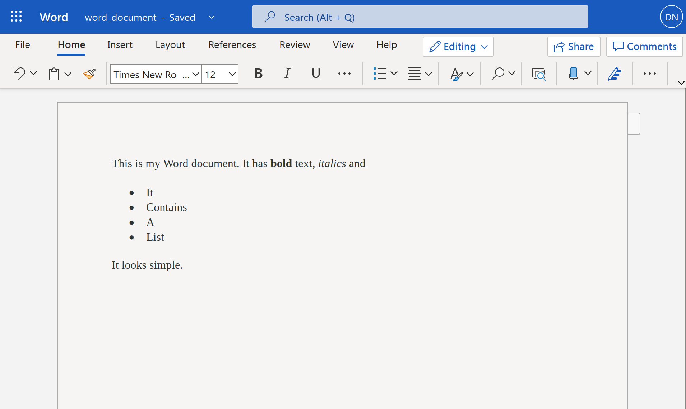
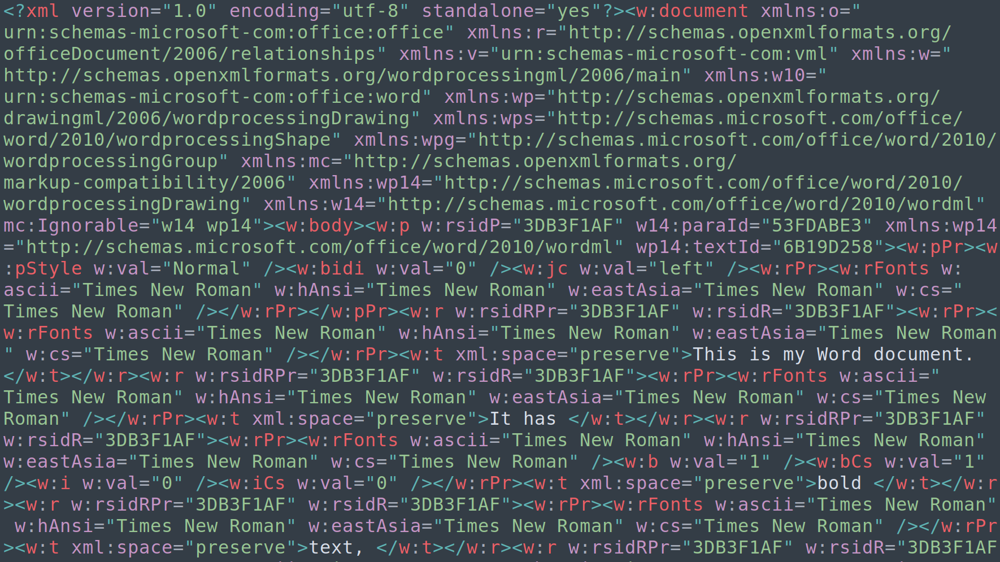
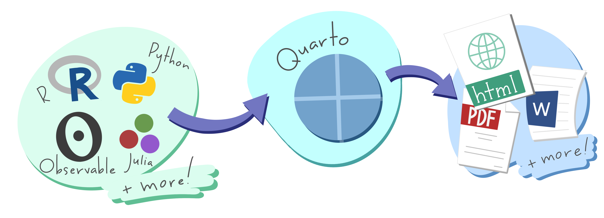
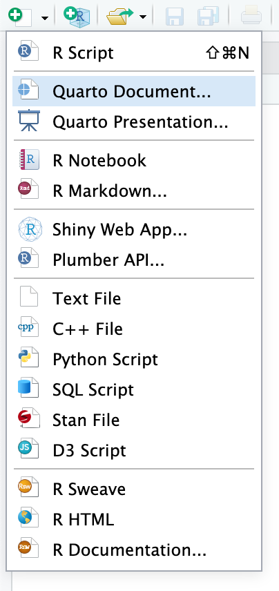
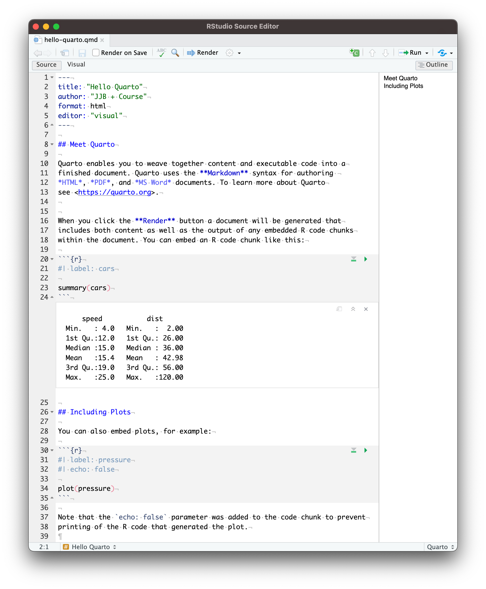
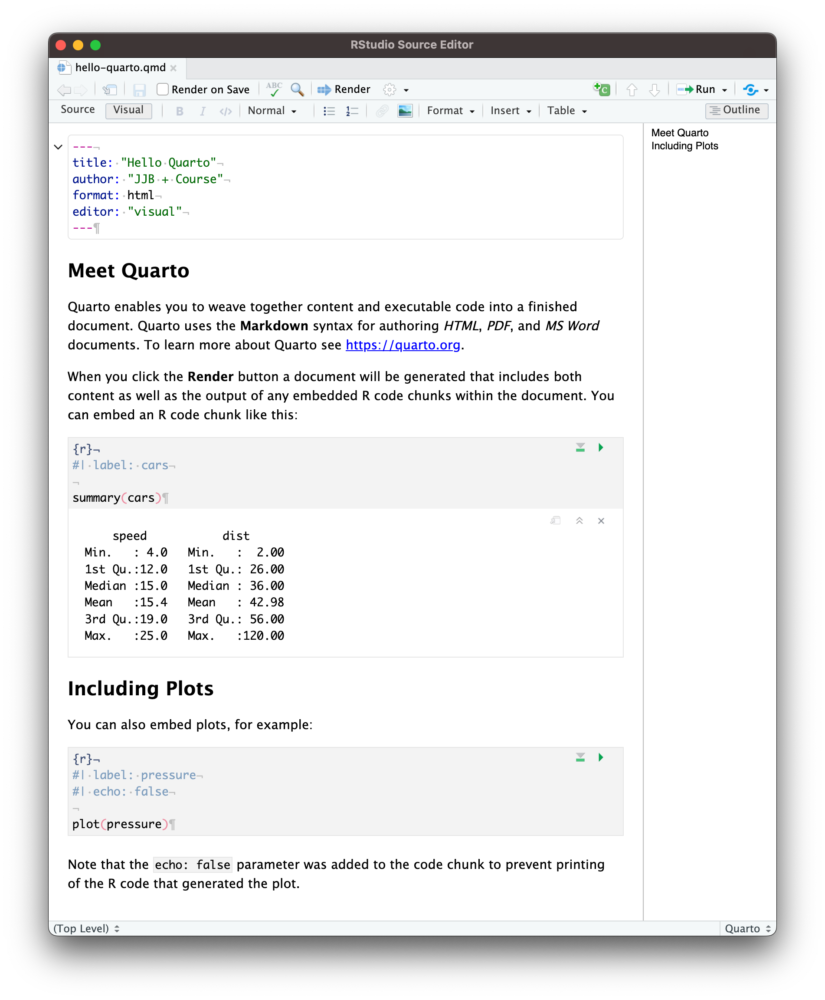
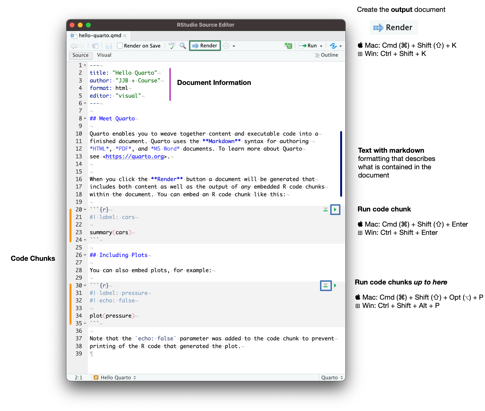
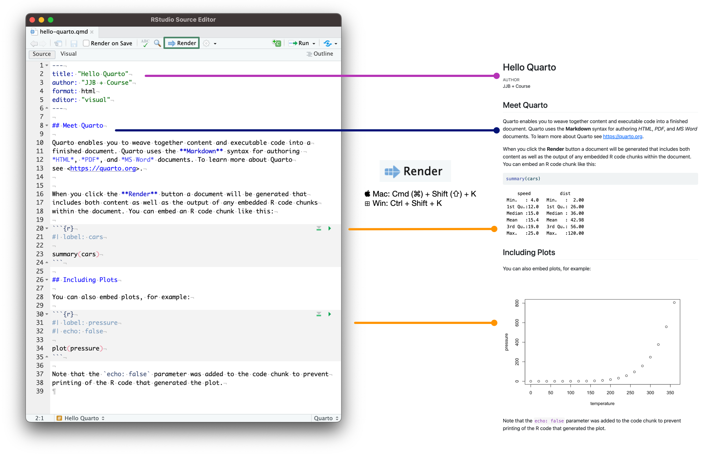
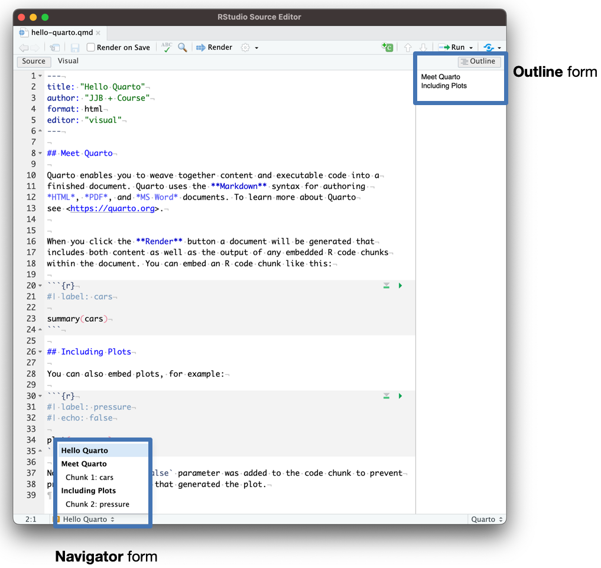

# The Credibility Revolution

## Open Science

::::: columns
::: {.column width="50%"}
<br>

-   Being open and transparent across all stages of the research process

    -   Key principles:

        -   Open access

        -   Open data

        -   Open code
:::

::: {.column width="50%"}
<br>

{fig-align="center" width="734"}
:::
:::::

## Open Science in Practice: Reproducible Manuscripts

::::: columns
::: {.column width="50%"}
{fig-align="center"}
:::

::: {.column width="50%"}
-   Today we are going to focus on reproducible manuscript

    

    

    
:::
:::::

## Typical workflow

1.  Do your analyses
2.  Open a program (e.g., Word)
3.  Copy-paste results and figures/tables
4.  Manually format your results and citations

::: incremental
<center>

<iframe width="560" height="315" src="https://www.youtube.com/embed/s3JldKoA0zw" frameborder="0" data-external="1" allowfullscreen>

</iframe>

</center>
:::

# The Problem

## Word

::::: columns
::: {.column width="50%"}

:::

::: {.column width="50%"}
{fig-align="center" width="1075"}
:::
:::::

## Inside

{fig-align="center"}

## Word issues

:::::: incremental
::::: columns
::: {.column width="50%"}
-   A .docx file is a compressed folder with lots of files
    -   Your text is buried in with a lot of formatting information

<!-- -->

-   Not reproducible
    -   Code is divorced from writing
:::

::: {.column width="50%"}
-   Difficult to maintain
    -   Errors!
-   What do I share?
    -   Lack of transparency
:::
:::::
::::::

## What Do We Want?

-   Combine narrative with code (literate programming)

-   Automatically generate figures and tables

-   Automatically render results in text

-   Format the content into a scientific paper (including citations!)

-   Something that looks pretty!

-   Rinse & repeat

## Hello Quarto!

::::: columns
::: {.column width="50%"}
-   Open source publishing system designed for reproducibility
-   Unify and extends the R Markdown ecosystem
:::

::: {.column width="50%"}
{fig-alt="The Quarto hexagon logo." fig-align="center"}
:::
:::::

## Big Universe

-   For EVERYONE
    -   Develop and switch formats without hassle

{fig-align="center"}

## Hello Quarto!

-   Websites (<https://www.drjasongeller.com>)

-   Blogs (<https://www.youtube.com/watch?v=_b9DZy7aH8I>)

-   Books (<https://jgeller112.github.io/dis_flu_modeling/>)

-   Want to guess how I created these slides?

## What is a Quarto?

{fig-align="center"}

## How Quarto Works

Quarto handles literate programming by using a series of programs:

](assets/quarto-images/rstudio-qmd-how-it-works.png)

-   **`knitr`** executes all code chunks and creates a new markdown (`.md`) file
-   **`pandoc`** takes the markdown file generated and converts it to the desired format.
-   **Render** inside of RStudio handles the interaction.

# Let's Write a Manuscript!

# Before We begin

::: callout-important
## Always start a new project folder!
:::

-   Creating a Quarto manuscript

    -   RStudio: New Project \> New Directory \> Quarto Manuscript
    -   Positron: New File \> Quarto Project \> Manuscript Project

## Packages

```{r}
#| echo: true
library(palmerpenguins) # penguins
library(quarto) # qmd 
library(rmarkdown) # markdown
library(tidyverse) # data wrangling
```

```{r}
#| eval: false
#| echo: true
install.packages('tinytex') # for use with pdf 
tinytex::install_tinytex()
# to uninstall TinyTeX, run tinytex::uninstall_tinytex()
```

-   You should also have Zotero installed along with Better BibTeX (nice, but not necessary)

# Overview of a Quarto Document

## Create a Quarto Document

::::: columns
::: {.column width="45%"}
In the top left, click the White Plus and select "Quarto Document..."

{width="175" fig-alt="Drop down menu containing Quarto Document creation button"}
:::

::: {.column width="45%"}
In the new prompt, enter a title, author name, and press "Create"

{fig-alt="New quarto document wizard allowing a title and author information to be set." fig-align="center"}
:::
:::::

## Source vs. Visual Mode

::::: columns
::: {.column width="45%"}
{fig-alt="Figure showing what a Quarto document looks like in Source Editing Mode."}
:::

::: {.column width="45%"}
{fig-alt="Figure showing what a Quarto document looks like in Visual Editing Mode."}
:::
:::::

::: footer
Visual Mode represents a **What You See Is What You Get (WYSIWYG) editor**. This mode is similar to Word.
:::

## Annotated Quarto Document {background-color="#E77500"}

{width="500" fig-alt="Annotated figure that describes the different sections of a Quarto document while in the source editor mode."}

## Output of a Quarto Document {background-color="#E77500"}

{width="500" fig-alt="Image showcasing how the source code of the document translated over into the rendered product."}

## Navigating a Quarto Document

{width="500" fig-alt="Quarto document section view using either the outline form or navigator form"}

## **Metadata & Header (YAML)**

-   The YAML header cotains basic metadata and rendering instructions

``` yaml
---
title: My Reproducible Manuscript
authors:
  - name: Norah Jones
    affiliation: The University
    roles: writing
    corresponding: true
bibliography: references.bib
format: html
---
```

-   Wait... what's the YAML acronym?

    -   Originally: "Yet Another Markup Language"

    -   Later: "YAML Ain't Markup Language"

-   Set global manuscript options with key-value pairs

## **Code**

```{r}
#| echo: fenced
#| eval: true
1 + 1
```

## **Text**

``` markdown
Section

This is a simple placeholder for the manuscript's main document [@knuth84].
```

# Writing in Markdown (NEXT)
