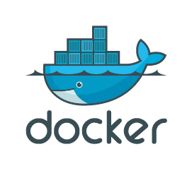
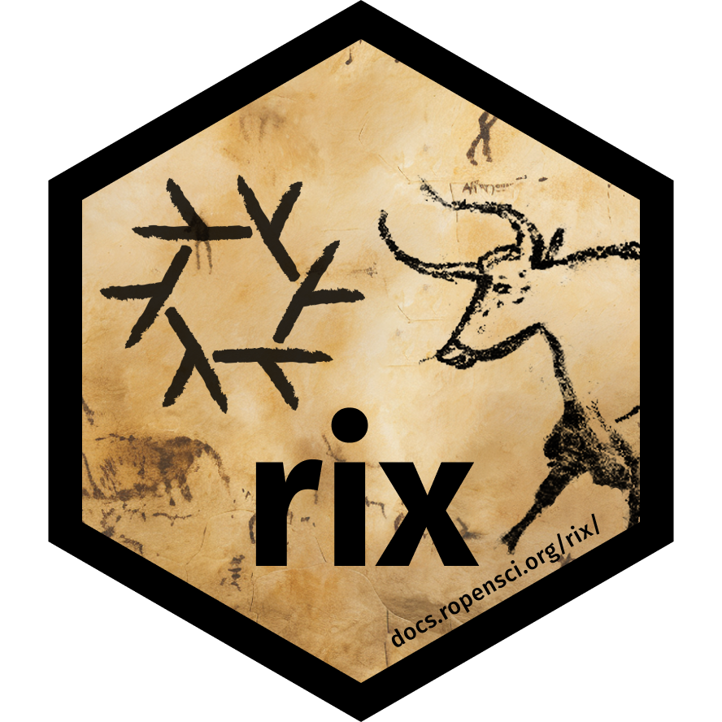

---
format:
  revealjs:
    theme: night
    embed-resources: true
    slide-number: true
    navigation-mode: linear
    controls: true
    code-overflow: wrap
    code-line-numbers: false
    incremental: true
    fontsize: "25pt"
    css: styles.css
---

# What's Next? {background-color="#E77500"}

## Try this

-   <https://github.com/jgeller112/Rix-Nix_Test>

-   Does it run for you?

## `Renv`

{fig-align="center" width="245"}

-   Most popular packages for reproducibility, and very easy to use:

    -   Creates a snap shot of packages used (and versions)

        -   Open an R session in the folder containing the scripts

        -   Run `renv::init()` and check the folder for `renv.lock`

        -   Use `renv::restore` to load all packages used at runtime

## `Renv`

-   Records, but does not restore the version of R

-   Installation of old packages can fail (due to missing OS-dependencies)

## Docker

{fig-align="center"}

::::: columns
::: {.column width="50%"}
-   Docker is a containerisation tool that you install on your computer

-   Docker allows you to build *images* and run *containers* (a container is an instance of an image)
:::

::: {.column width="50%"}
-   Docker images:

    1.  Contain all the software and code needed for your project

    2.  Are immutable (cannot be changed at run-time)

    3.  Can be shared on- and offline
:::
:::::

## Docker

-   Docker is very useful and widely used

-   But the entry cost is high (familiarity with Linux is recommended)

-   Single point of failure (what happens if Docker gets bought, abandoned, etc? **quite unlikely though**)

-   Not actually dealing with reproducibility per se, we’re “abusing” Docker in a way

    ::: callout-tip
    -   Can use Code Ocean instead (<https://codeocean.com/>) - costs money
    -   Binder (free) and you can set it up within manuscript
    :::

## Nix/`Rix`

-   Nix

    -   Package manager: tool to install and manage *packages*

    -   Package: any piece of software (not just R packages)

## Nix/`Rix`

-   Gold standard of reproducibility: R, R packages and other dependencies must be managed

-   Nix is a package manager actually focused on reproducible builds

-   Nix deals with everything, with one single text file (called a Nix expression)!

    -   These Nix expressions *always* build the exact same output

## Nix/`Rix`

::::: columns
::: {.column width="50%"}
{fig-align="center" width="404"}
:::

::: {.column width="50%"}
-   `{rix}` ([website](https://docs.ropensci.org/rix/)) makes writing Nix expression easy!

-   Simply use the provided `rix()` function:
:::
:::::

```{r}
#| eval: false 
#| echo: true

# download latest version
install.packages("rix", repos = c(
  "https://ropensci.r-universe.dev"
))

library(rix)

rix(date = "2025-01-27", # date or r version wanted
    r_pkgs = c("brms", "palmerpenguins"), # r packages
    system_pkgs = NULL, # system dependencies
    git_pkgs = NULL, # github packages
    tex_pkgs = NULL, # latex packages
    ide = "code", # what ide you want to use rstudio/positron/vscode
    project_path = ".") # project path
```

## Nix/`Rix`

-   List required R version and packages

-   Optionally: more system packages, packages hosted on Github, or LaTeX packages

-   Optionally: an IDE (Rstudio, Radian, VS Code or “other”)

-   Work interactively in an (relavitely) isolated, project-specific and reproducible environment!

## Nix/`Rix`

```{r}
#| code-line-number: "3:9"
#| echo: true
#| eval: false 

rix(date = "2025-03-10", # date or r version wanted
    r_pkgs = c("brms", "palmerpenguins"), # r packages
    system_pkgs =  c("quarto", "git", "cmdstan"), # system dependencies
    git_pkgs = list(
      list(
        package_name = "cmdstanr",
        repo_url = "https://github.com/stan-dev/cmdstanr",
        commit = "12211d4b35605d416d6e22078db81cfe9e5a64f5")
      ), # github packages
    tex_pkgs = NULL, # latex packages
    ide = "code", # what ide you want to use rstudio/positron/vscode
    project_path = ".") # project path
```

## Nix/`Rix`

-   Steps:

1.  Install Nix on your computer
2.  `rix::rix()` generates a `default.nix` file
3.  Build expressions using `nix-build` (in terminal) or `rix::nix_build()` from R
4.  “Drop” into the development environment using `nix-shell`

# `Rix` Example
